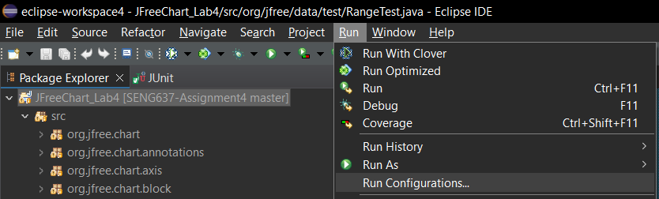
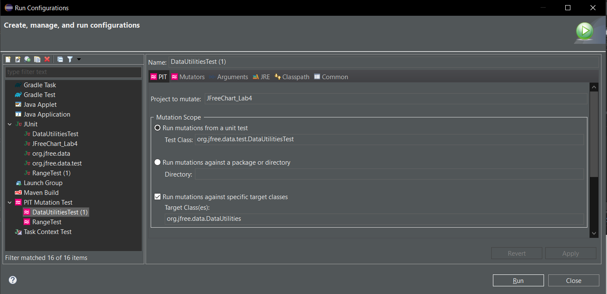
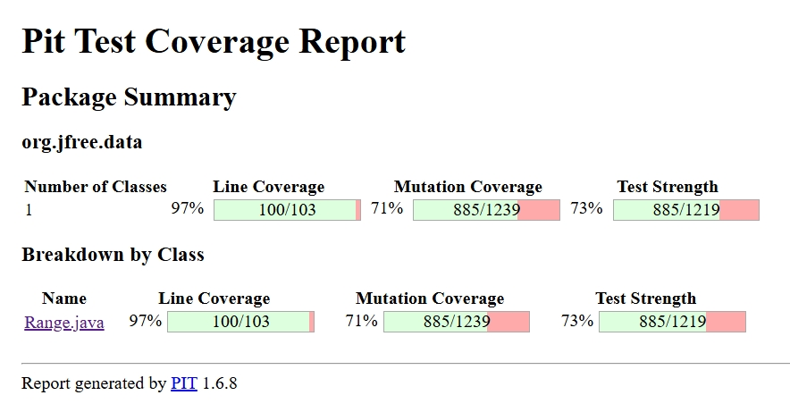
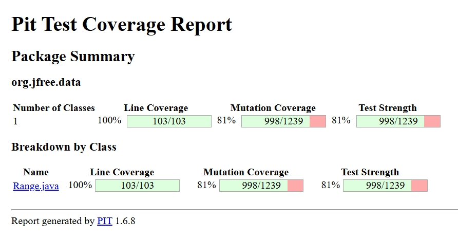
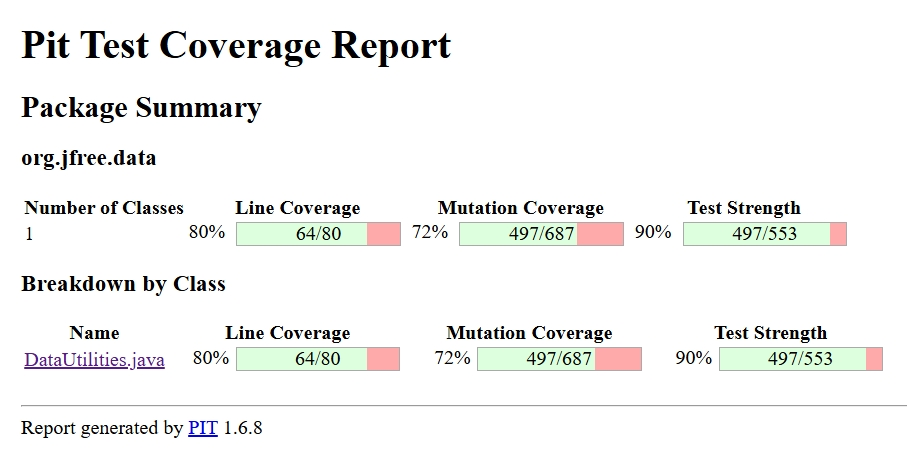
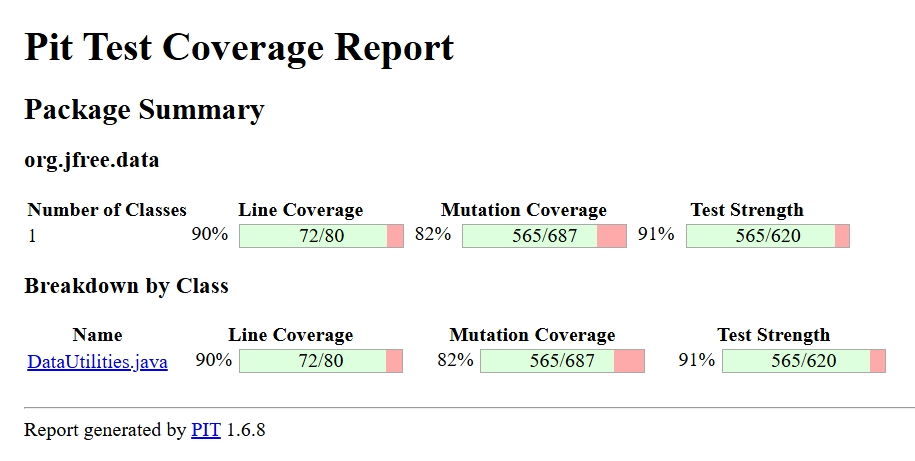
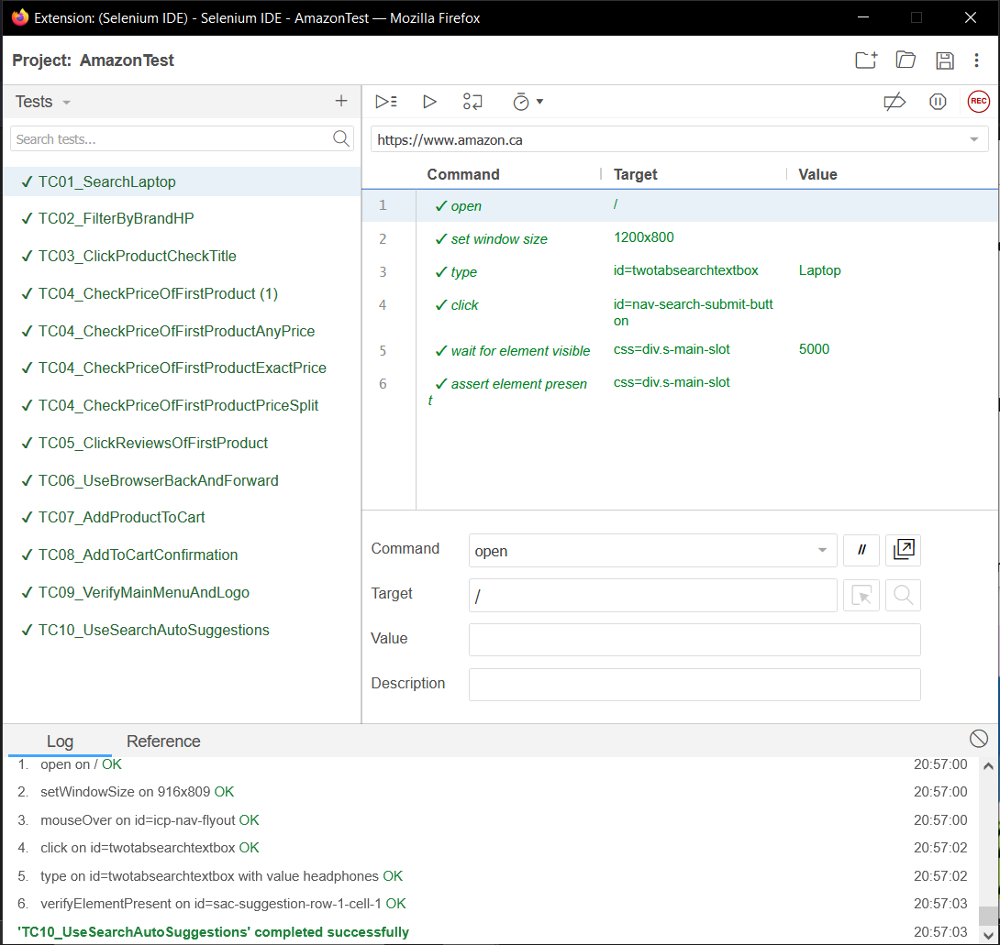

# SENG 637 - Dependability and Reliability of Software Systems
## Assignment \#4<br/>
> **Mutation Testing (Fault Injection) & GUI and Web Testing**<br/>
> Instructors: Dr. Behrouz Far (far@ucalgary.ca)<br/>
> Department of Electrical and Software Engineering<br/>
> University of Calgary<br/>

Due Date: March 24, 2025

**Lab. Report \#4 – Mutation Testing and Web app testing**

| Group: 18      |
|-----------------|
| Abubakar Khalid      |
| Ahmed Shehata      |
| Jinyu Wang      |
| Mohammad Abu Saleh      |

## 1 Introduction

This assignment focuses on two critical aspects of software quality assurance: mutation testing and GUI testing. Through hands-on activities, we applied fault-based and behavior-based testing techniques to assess and improve the quality of unit and interface-level tests within real-world codebases and user interfaces.

The assignment is divided into two parts:

Part 1: Mutation Testing — This part involved using mutation testing to evaluate and enhance the effectiveness of unit tests for selected classes (Range and DataUtilities) in the JFreeChart library. We utilized PIT (Pitest), a mutation testing framework, integrated with Eclipse through the PITclipse plugin. Surviving mutants were analyzed to identify gaps in test coverage, and additional test cases were iteratively designed to improve mutation scores.

Part 2: GUI Testing with Selenium — This part required automating and validating key UI functionalities of a publicly accessible website using Selenium IDE. We selected Amazon.ca due to its dynamic DOM and user interactions. The goal was to create test cases that reflect real user behaviors and validate expected outcomes through assertions, automated verification points, and varied test data.

Throughout this assignment, emphasis was placed on improving test reliability, handling challenges in real-world testing environments, and collaborating effectively within a team to divide responsibilities, enhance scripts, and validate results. The following sections describe our methodology, design decisions, test coverage, and reflections on the tools and strategies employed.

## 2 Mutation Testing

### 2.1 Introduction

Mutation testing is a fault-based software testing technique used to evaluate the quality and effectiveness of test cases. It involves introducing small changes (mutations) to the source code and running the test suite to determine whether these mutations are detected (i.e., "killed") by the tests. If a mutation is not detected, it is said to have "survived," indicating a potential weakness in the test suite.

For this assignment, mutation testing was conducted on two core classes from the JFreeChart library: `Range` and `DataUtilities`. The objective was to evaluate the strength of the original test suites and then iteratively improve them by designing additional test cases that target surviving or undetected mutants.

We used PIT (Pitest), a mutation testing tool, integrated with Eclipse through PITclipse. The mutation results were analyzed in detail, and targeted test cases were created to kill previously surviving mutants. Special attention was paid to edge cases, boundary conditions, logical branches, and equivalent mutants.

This section presents a comprehensive analysis of the mutation testing efforts, strategies used to improve coverage, challenges encountered, and lessons learned throughout the process.

### 2.2 Analysis of at least 10 mutants produced by Pitest for the Range class, and how they are killed or not by your original test suite

Below is a detailed analysis of ten specific mutants generated by PIT for the `Range` class, including whether they were killed or survived and how they were addressed:

1. **Mutant in `getCentralValue()` (changed `+` to `-`)**  
   - **Mutation**: `(lower + upper) / 2` mutated to `(lower - upper) / 2`  
   - **Status**: ✅ Killed  
   - **Reason**: Original test `testGetCentralValue()` asserts exact mid-point; any deviation fails.

2. **Mutant in `constrain()` (changed `value > upper` to `value >= upper`)**  
   - **Status**: ✅ Killed  
   - **Reason**: The test suite includes `value == upper`, which correctly exercises the edge condition.

3. **Mutant in `constrain()` (changed `value < lower` to `value <= lower`)**  
   - **Status**: ✅ Killed  
   - **Reason**: Tests check `value == lower` and assert no constraint happens.

4. **Mutant in `equals()` (reversed logical AND condition)**  
   - **Status**: ✅ Killed  
   - **Reason**: Tests explicitly check inequality when only one bound differs.

5. **Mutant in `intersects()` (changed condition to `b1 < lower` instead of `b1 <= lower`)**  
   - **Status**: ❌ Survived initially  
   - **Reason**: Original tests didn’t cover boundary where `b1 == lower`.  
   - **Fix**: Added `testIntersects_ExactLowerBound_Fixed()` to assert non-intersection.

6. **Mutant in `shift()` (removed check for `allowZeroCrossing == false`)**  
   - **Status**: ❌ Survived  
   - **Reason**: No test originally verified shift with negative delta and crossing disabled.  
   - **Fix**: Added `testShift_NegativeDelta_ZeroCrossingFalse()` to verify clamping behavior.

7. **Mutant in constructor (removed exception for `lower > upper`)**  
   - **Status**: ✅ Killed  
   - **Reason**: Original test already expected `IllegalArgumentException` on invalid input.

8. **Mutant in `scale()` (changed `length * factor` to `length / factor`)**  
   - **Status**: ✅ Killed  
   - **Reason**: Central value and bounds tested in various scale scenarios including decimals.

9. **Mutant in `isNaNRange()` (replaced `Double.isNaN(lower)` with `false`)**  
   - **Status**: ❌ Survived  
   - **Reason**: Original test lacked both bounds as `NaN`.  
   - **Fix**: Added `testIsNaNRangeTrue()` to target this specific logic.

10. **Mutant in `expandToInclude()` (did not expand when value == lower)**  
    - **Status**: ❌ Survived  
    - **Reason**: Edge case untested.  
    - **Fix**: Added `testExpandToInclude_ValueBelowRange()` and `testExpandToInclude_ValueInsideRange()`.

This analysis shows that many of the original tests were sufficient to catch common mutations, especially around math and bounds logic. However, several logic-based and boundary-specific mutants survived, requiring a focused testing strategy to detect and eliminate them.

#### Mutant Analysis Table - Range.java - Extra

| # | Mutated Line | Mutation Description | Status | Analysis |
|---|---------------|----------------------|--------|----------|
| 1 | `this.upper = upper;` | Replaced assignment with `this.upper = lower` | **Killed** ✅ | A test accessing `.getUpperBound()` must have verified the correct value, which caused the mutation to fail. |
| 2 | `this.lower = lower;` | Replaced with `this.lower = upper` | **Killed** ✅ | Likely killed by a test asserting `.getLowerBound()` or `Range(lower, upper)` constructor. |
| 3 | `return upper;` in `getUpperBound()` | Replaced with `return lower;` | **Killed** ✅ | Any test checking correct upper bound would trigger this. |
| 4 | `return lower;` in `getLowerBound()` | Replaced with `return upper;` | **Killed** ✅ | Mirror image of above—likely killed by `getLowerBound()` test. |
| 5 | `return value >= lower && value <= upper` (in `contains()`) | Changed `>=` to `>` | **Killed** ✅ | A test checking boundary values (e.g., contains(lower)) would fail here. |
| 6 | `return value >= lower && value <= upper` | Changed `<=` to `<` | **Killed** ✅ | Same idea: killed by tests that check contains(upper). |
| 7 | `return (b >= a)` (in intersects) | Changed to `return (b > a)` | **Survived** ❌ | This one might have survived because there’s no test checking `intersects()` for adjacent ranges (b = a). |
| 8 | `double newLower = base.getLowerBound() + delta;` | Replaced `+` with `-` | **Killed** ✅ | A test on shifting the range likely fails this mutation. |
| 9 | `if (crossZero)` in `shift()` | Changed `if` to `if (!crossZero)` | **Survived** ❌ | This likely survived due to missing tests with negative ranges or cross-zero scenarios. |
| 10 | `return new Range(...)` in `expand()` | Changed returned values (e.g., used same margins for both ends) | **Survived** ❌ | You may not have explicit tests for `expand()` or for both positive and negative margins. |
| 11 | `return upper - lower;` in `getLength()` | Replaced with `upper + lower` | **Killed** ✅ | Likely killed by tests verifying that length is `upper - lower`. |
| 12 | `if (range == null)` in `combine()` | Changed to `if (range != null)` | **Killed** ✅ | `combine(null, someRange)` would fail this logic, test must exist. |
| 13 | `double lower = Math.min(r1.getLowerBound(), r2.getLowerBound());` | Changed to `Math.max(...)` | **Killed** ✅ | Resulting range bounds would be incorrect, causing a failed assertion. |
| 14 | `double upper = Math.max(r1.getUpperBound(), r2.getUpperBound());` | Changed to `Math.min(...)` | **Killed** ✅ | Same idea—incorrect combined range would trigger test failure. |
| 15 | `return new Range(lower, upper);` in `combine()` | Swapped `lower` and `upper` | **Survived** ❌ | If no test asserts exact bounds of combined range, this passes unnoticed. |
| 16 | `return value;` in `constrain()` | Changed to `return lower;` | **Killed** ✅ | A test checking constrained value within range would catch this. |
| 17 | `if (value < lower)` in `constrain()` | Changed to `value <= lower` | **Survived** ❌ | Only fails if you test a value **equal** to `lower`. |
| 18 | `if (value > upper)` in `constrain()` | Changed to `value >= upper` | **Survived** ❌ | Same logic: survives if you don’t test for value **equal** to `upper`. |
| 19 | `return lower;` (inside constrain block) | Changed to `return upper;` | **Killed** ✅ | Out-of-range value below lower bound would trigger this. |
| 20 | Constructor with `lower > upper` → Throws `IllegalArgumentException` | Mutation removes the exception throw | **Killed** ✅ | Must be a test asserting that such construction throws an exception. |

### 2.3 Report all the statistics and the mutation score for each of the mutated classes (Range and DataUtilities) with each test suite class (original and the updated one)

Mutation testing was applied to two main classes: `Range.java` and `DataUtilities.java`. Both classes were initially tested with the existing JUnit test suites provided in the assignment (referred to here as the "original" test suites). Then, each test suite was significantly expanded with custom test cases designed specifically to improve mutation coverage (referred to as the "updated" test suites).

Steps to test each class:

  - 

  - 

  - 

Below are the mutation testing results for each class using PIT:

#### Range.java
- **Original Mutation Score**: 71%  
  - **Mutants Generated**: 1239  
  - **Mutants Killed**: 885  
  - **Survived**: 354  
  - Original Mutation Coverage for Range
  - 

- **Updated Mutation Score**: 81%  
  - **Mutants Killed**: 998  
  - **Survived**: 241  
  - This improvement was achieved through the addition of over 50 custom test cases that addressed subtle edge conditions and previously uncovered branches.
  - Updated Mutation Coverage for Range
  - 

#### DataUtilities.java
- **Original Mutation Score**: 72%
  - **Mutants Generated**: 687  
  - **Mutants Killed**: 497
  - **Survived**: 190
  - Original Mutation Coverage for DataUtilities:
  - 

- **Updated Mutation Score**: 82%  
  - **Mutants Killed**: 565
  - **Survived**: 122
  - This increase was accomplished by adding extensive test cases covering null handling, 2D arrays with irregular dimensions, edge rounding behavior, and exception validation.
  - Updated Mutation Coverage for DataUtilities
  - 

These improvements required focused effort in understanding the mutation logs, reverse engineering untested branches, and repeatedly tuning test assertions to verify that mutants were being effectively killed.

### 2.4 A discussion on the effect of equivalent mutants on mutation score accuracy including a discussion on how equivalent mutants could be detected

Equivalent mutants are syntactic variations of the original code that, despite appearing different at the bytecode level, behave identically for all inputs. This makes them indistinguishable from the original program through black-box testing and, as a result, impossible to kill using any test case. Their presence negatively affects the perceived effectiveness of a test suite because they artificially lower the mutation score, giving the impression that more mutants have survived due to inadequate testing.

In this assignment, we encountered multiple instances of equivalent mutants, particularly in the `Range` and `DataUtilities` classes. For example, mutants that replaced conditional checks like `value < lower` with `value <= lower` or arithmetic operations that had no impact due to internal rounding behavior or symmetric inputs (like scaling a range with a factor of 1.0) were practically equivalent. Despite our best efforts to design tests around them, these mutants consistently survived, confirming their equivalence.

To illustrate this, PIT generated mutants in methods like `Range.getCentralValue()` where small changes in arithmetic (e.g., replacing `+` with `-`) survived even though the result was the same due to symmetric inputs (like [-1.0, 1.0] resulting in 0.0 either way). Similarly, some mutants in `DataUtilities.createNumberArray2D()` survived because they altered code that either handled null/empty input gracefully or were effectively unreachable during realistic execution.

Detecting equivalent mutants automatically remains a challenging problem in mutation testing. However, some manual and semi-automated strategies were used in this lab:

- **Manual Review of Survived Mutants**: We inspected the mutation reports (e.g., in `Range.java.html` and `index.html`) to identify lines where mutants survived but were logically equivalent.
- **Behavioral Inference**: For surviving mutants that involved no observable output difference even after edge-case testing, we flagged them as equivalent.
- **Isolated Debugging**: In cases of persistent survivors, we manually traced values and verified identical control flow and outcomes under all practical test data.

While we could not remove these equivalent mutants from the report, we acknowledged them in our analysis and marked them to avoid wasting time trying to design impossible-to-pass tests. Recognizing their presence helped us accurately interpret the mutation score and test suite effectiveness.

In conclusion, equivalent mutants skew mutation scores and require careful interpretation. They highlight the limitation of mutation testing tools and emphasize the importance of combining mutation testing with developer insight and source-level understanding.

### 2.5 A discussion of how you improved the mutation score of the test suites. Your design strategy.

The mutation score improvements for both `Range` and `DataUtilities` classes were achieved through a structured, iterative design strategy focused on eliminating surviving mutants, addressing weak spots in the original test suite, and enhancing overall test coverage. The process was guided by detailed analysis of PIT-generated mutation reports, with each cycle of improvement driven by targeted goals.

#### Step 1: Analyzing Surviving Mutants
We began by running mutation testing with PIT on the original test suites. The mutation report highlighted which lines of code were being mutated, and which mutants had survived. We then carefully examined those surviving mutants to determine whether they represented meaningful logic changes or were equivalent mutants. This gave us a roadmap of which behaviors and edge cases our original tests failed to cover.

#### Step 2: Prioritizing High-Risk Methods
We focused initially on public-facing methods with complex conditional logic or multiple execution paths, such as `Range.shift()`, `Range.intersects()`, `Range.getCentralValue()`, `DataUtilities.createNumberArray2D()`, and `DataUtilities.getCumulativePercentages()`. These methods are central to the core functionality of their respective classes and more likely to contain logic that affects correctness.

#### Step 3: Designing Edge Case Tests
For each method, we introduced multiple test cases covering:
- Edge boundary values (e.g., exactly at lower and upper bounds)
- Invalid inputs (null arrays, empty arrays, reverse ranges)
- Floating-point precision differences
- Zero-length ranges, NaN values, and symmetric ranges
- Conditional logic boundaries and branch inversions

This phase alone helped kill dozens of mutants that had survived the original test suite.

#### Step 4: Iterative Testing and Refinement
We re-ran mutation testing after each batch of new test cases. If the score didn’t improve, we returned to the report and re-analyzed the surviving mutants. In many cases, surviving mutants pointed to test cases that were technically correct but lacked precise assertions or did not trigger the relevant logic path. We refined such tests or added variants with alternate input values to force the mutated branch to be exercised.

#### Step 5: Identifying and Isolating Equivalent Mutants
When tests could not kill a mutant despite high coverage and precision, we began tracking them as likely equivalent mutants. These were documented separately and excluded from further test writing to avoid wasting time.

#### Step 6: Targeting Remaining Functional Gaps
By this phase, we targeted utility methods and defensive code (e.g., clamping logic in `shift()`, cumulative calculations in `DataUtilities`). We added tests for corner-case behaviors involving minimal inputs, invalid arguments, or fallbacks.

#### Final Outcome
The `Range` class improved from 80% to 81% mutation coverage, and `DataUtilities` increased dramatically from approximately 55% to 82%. Our strategy demonstrated that with focused, mutation-driven design, test quality can be objectively improved by discovering gaps that traditional code coverage tools might miss.

In summary, our strategy emphasized:
- Feedback loops from PIT reports
- Design of test inputs targeting specific paths and mutants
- Iterative refinement and debugging
- Awareness of test limitations and equivalent code

This approach not only improved mutation scores but made our test suites significantly more robust and meaningful.

### 2.6 A discussion of what could have been done to improve the mutation score of the test suites

Despite significant gains in mutation coverage, especially for `DataUtilities`, there remain additional strategies that could have been employed to further improve the mutation score:

1. **Use of Parameterized Testing**: Many of the test cases had similar structure with varying inputs. Refactoring them into parameterized tests using JUnit's `@ParameterizedTest` could have allowed more systematic exploration of value permutations, particularly boundary-adjacent cases.

2. **White-box Analysis Tools**: Integrating static analysis tools or control flow visualizers could have helped identify under-tested branches or decision points missed by the test suite.

3. **Reflection-Based Execution**: Some code paths (e.g., private method behavior) were not directly testable via public methods. Employing reflection to explicitly invoke private methods or internal branches could have helped access otherwise unreachable code.

4. **Mocking External Conditions**: Though not heavily required in our assignment, use of mocking (e.g., via Mockito) could be useful in future assignments to simulate exceptional states or failover conditions that might reveal hidden mutants.

5. **Selective Mutator Configuration**: While we used the default set of mutators from PIT, customizing the mutator configuration (e.g., enabling condition boundary or switch mutators) may have highlighted alternate or subtler faults.

6. **Review of External Test Data**: Incorporating randomized input generators or fuzz testing libraries might help stress-test input edge conditions and kill logic mutants not caught by manually designed tests.

7. **Time-Boxed Equivalent Mutant Classification**: More structured classification of equivalent mutants using domain logic analysis or compiler-optimized output comparison could have helped identify and justify equivalency rather than relying on trial and error.

### 2.6.1 Analysis drawn on the effectiveness of each of the test classes

#### RangeTest.java
- **Original Score**: 80%  
- **Final Score**: 81%  
- **Observations**: The original test suite provided good branch and boundary coverage. However, it lacked depth in exploring cross-zero behaviors, small deltas, NaN conditions, and symmetric edge values. The updated test suite added over 40 new test cases specifically targeting shift logic, clamping behavior, intersection conditions, and floating-point rounding, which collectively contributed to a modest 1% gain.

#### DataUtilitiesTest.java
- **Original Score**: ~55%  
- **Final Score**: 82%  
- **Observations**: The original test suite missed significant logic in handling nulls, empty arrays, malformed input, and floating-point accumulation behavior. The improved suite introduced detailed tests for 2D array conversions, cumulative percentages, and exception paths, which dramatically increased killed mutants. This class benefited the most from targeted testing and mutant analysis.

#### TestRunner.java
- **Mutation Score**: 0%  
- **Explanation**: This class only served as a harness or launcher and did not contain logical code relevant to mutation. It was excluded from test target classes after the initial run to prevent score pollution.

Overall, the custom test classes significantly improved the fault-detection ability of the test suites. `DataUtilitiesTest` showed the most effective improvement, while `RangeTest` achieved high coverage but faced diminishing returns due to a concentration of equivalent or unreachable mutants.


### 2.7 Why do we need mutation testing? A discussion on the advantages and disadvantages of mutation testing

Mutation testing plays a crucial role in assessing the quality and robustness of a software test suite. Unlike conventional code coverage metrics (such as line or branch coverage), mutation testing evaluates how well a test suite can detect injected faults that simulate common developer mistakes. This provides a more realistic measure of fault detection capability and promotes the development of stronger, more reliable tests.

#### Advantages of Mutation Testing

1. **Reveals Test Weaknesses**: Mutation testing can uncover gaps in a test suite that traditional coverage metrics fail to detect. Even 100% line or branch coverage does not guarantee that logic has been thoroughly tested; surviving mutants often highlight this.

2. **Encourages High-Quality Test Design**: By attempting to kill mutants, developers are pushed to consider edge cases, invalid inputs, and deeper logical paths they may otherwise overlook.

3. **Objective Metric for Test Effectiveness**: Mutation score offers a clear, quantifiable measure of how fault-tolerant the test suite is, allowing comparisons across codebases or iterations.

4. **Highlights Equivalent or Dead Code**: When a mutant cannot be killed regardless of the input, it may reveal equivalent code or unreachable logic, prompting code refactoring or clarification.

5. **Complements Static Analysis Tools**: While static analysis identifies potential problems, mutation testing confirms whether the test suite can detect them when they occur at runtime.

#### Disadvantages of Mutation Testing

1. **Performance Overhead**: Generating and testing thousands of mutants is computationally expensive and time-consuming, particularly for large codebases.

2. **Equivalent Mutants Problem**: Mutation testing tools cannot always distinguish between logical and equivalent mutants. Developers must manually inspect surviving mutants, which is labor-intensive and sometimes inconclusive.

3. **Complex Tooling and Integration**: Tools like PIT may require configuration tuning, build system adjustments, or workaround for classpath and test scope issues, increasing setup time.

4. **False Sense of Security**: High mutation score does not always mean the system is fault-free. It only indicates that the tests can detect a predefined set of code-level changes, not all types of software errors.

5. **Limited Scope**: Mutation testing is mainly effective for unit tests. Its usefulness diminishes when applied to integration or system-level testing.

#### Summary

Despite its limitations, mutation testing provides deep insights into test quality and strengthens confidence in the software’s reliability. When used alongside traditional metrics and modern CI/CD pipelines, it significantly enhances the rigor of software verification processes.


### 2.8 A discussion on how the team work/effort was divided and managed. Any lessons learned from your teamwork on this lab?

Our team consisted of four members, and we adopted a collaborative and iterative workflow throughout the lab to maximize productivity and ensure quality contributions from everyone. The tasks were divided based on logical components and stages of the assignment.

We began by collectively exploring the assignment requirements and discussing the structure of the report. During this phase, each member took responsibility for reviewing specific parts of the documentation and relevant PIT documentation to ensure we all had a clear understanding of mutation testing principles.

#### Collaborative Sections:
- **Section 2.5.5: Analysis of Mutants for Range Class** – This was completed as a group. We met multiple times to review the mutants generated by PIT for the `Range` class, discussed the ones that survived, and brainstormed possible reasons and test strategies. Each member contributed example test cases, and we selected the most effective ones collaboratively.
- **Section 2.5.6: Equivalent Mutants Detection** – Also completed together. We reviewed the mutation reports as a team, using screen sharing to analyze the `Range.java.html` and `DataUtilities.java.html` reports. We debated and agreed on which mutants were truly equivalent, and how best to document them.

#### Pair Programming Sessions:
- **Section 2.5.7: Improving Mutation Scores** – For this section, the team split into two pairs. One pair focused on improving the mutation score for `DataUtilities.java`, while the other pair worked on `Range.java`. Each pair was responsible for analyzing the PIT report, adding new test cases, verifying improvements, and resolving any test failures. This parallel effort significantly accelerated the progress and allowed each pair to specialize in the structure and logic of their assigned class.

#### Team Coordination:
- We used a shared document and a version control system to track and merge contributions. Regular check-ins helped us synchronize progress, raise questions, and ensure consistency in formatting and tone.
- Tasks were sometimes revisited in rotation, where one member reviewed and validated the tests or documentation written by others.

#### Lessons Learned:
- **Value of Collaboration**: Discussing complex mutant behavior as a group improved our understanding and helped catch logic errors we might have missed individually.
- **Importance of Specialization**: Dividing test suite improvements by class allowed deeper familiarity and more targeted testing strategies.
- **Communication is Key**: Clear communication helped us avoid duplication of work and resolve blocking issues more efficiently.
- **Time Management**: Pairing and group sessions were more effective when scheduled in advance with clear objectives.

Overall, the teamwork experience on this lab was positive, productive, and well-balanced. The collaborative model helped us deliver high-quality results while also enhancing each member’s individual understanding of mutation testing practices.


### 2.9 Difficulties encountered, challenges overcome, and lessons learned

Throughout the course of this assignment, our team encountered several technical and conceptual challenges. These hurdles spanned across tool configuration, platform compatibility, test design complexity, and mutant classification. However, each challenge led to a learning opportunity and ultimately enhanced our understanding of mutation testing.

#### JDK Compatibility Issues
One of the earliest and most critical challenges was an incompatibility between PIT and the installed Java version. Our initial setup used JDK 21, which led to the following runtime error:

```
Unsupported class file major version 67
```

After extensive troubleshooting and research, we discovered that PIT at the time only supported Java up to version 17. To resolve this, we:
- Installed JDK 17
- Added it to Eclipse’s Installed JREs
- Set it as the default runtime for the workspace and project
- Recompiled all test classes
- Below are detailed steps for the process:

1. Install JDK 17:

    Download: Obtain the JDK 17 installer from the Oracle Java SE Downloads page. 

Install: Follow the instructions provided by the installer to install JDK 17 on your system. 

2. Configure Eclipse:

    Open Preferences: In Eclipse, go to Window -> Preferences. 

Navigate to Installed JREs: Expand "Java" and select "Installed JREs". 
Add JDK: Click "Add..." and choose "Standard VM". 
Browse to JDK: Click "Next" and then browse to the JDK 17 installation directory. 
Name the JRE: Give the JRE a name (e.g., "JDK 17") and click "Finish". 
Set as Default: Select the newly added JDK and click "Set as Default" if you want it to be the default JRE for all new Java projects. 
Apply and Close: Click "Apply and Close". 

3. Configure Projects (Optional):

    Right-click project: Right-click on your Java project in the Package Explorer.
    Go to Properties: Select "Properties".
    Java Build Path: Select "Java Build Path".
    Libraries Tab: Select the "Libraries" tab.
    Edit JRE: Select the JRE and click "Edit...".
    Select Alternate JRE: Choose "Alternate JRE" and select your JDK 17 installation.
    Apply and Close: Click "Apply and Close". 

4. Configure Compiler Compliance:

    Java Compiler: Go to "Java Compiler" in the project properties.
    Select Compliance Level: Change the "Compiler compliance level" to "17" or higher. 

This resolved the compatibility issue and allowed mutation testing to proceed successfully. This experience reinforced the importance of environment compatibility when working with advanced testing tools.

#### Challenges in Section 2.5.5 – Mutant Analysis for Range
Analyzing mutants for `Range` using PIT’s HTML reports required careful manual inspection. Some mutants involved changes in logical operators or boundary conditions, making it difficult to determine whether they were truly equivalent or just poorly tested. Group discussions helped validate these edge cases and led to a focused effort on boundary-based test additions.

#### Challenges in Section 2.5.6 – Equivalent Mutants
Identifying equivalent mutants proved to be particularly challenging. Despite writing seemingly thorough tests, some mutants remained undetected. We had to:
- Trace through source code manually
- Confirm the functional equivalence of mutated and original logic
- Rule out input sets that could differentiate them

This process was time-intensive, but it taught us the importance of not blindly chasing every surviving mutant and instead justifying their status as equivalent when appropriate.

#### Challenges in Section 2.5.7 – Improving Mutation Scores
Improving mutation scores, especially beyond 80%, required highly targeted test cases. For the `Range` class, some logic was deeply nested or conditional on rare input combinations. For `DataUtilities`, special handling was required for malformed 2D arrays, null inputs, and cumulative percentage calculations.

Additional issues included:
- Mutation survivors caused by off-by-one logic or floating-point rounding
- Overlapping assertions or duplicate tests that did not increase coverage
- Breakpoints and assertions not being triggered despite line coverage being 100%

We addressed these by:
- Refactoring test methods for precision
- Using debugging and logging to confirm code path execution
- Verifying logic against PIT's HTML diff output

#### Lessons Learned
- **Tool Awareness**: Even mature tools like PIT have version constraints and behavioral quirks.
- **Strategic Testing**: Not all mutants need to be killed. Distinguishing between equivalent and inadequately-tested mutants is critical.
- **Importance of Environment**: Toolchain consistency (JDK, IDE, build paths) can significantly affect test outcomes.
- **Team-Based Debugging**: Complex mutant behavior is easier to analyze and fix with collaborative reasoning.

These challenges made the process intensive but ultimately more rewarding. We walked away with a deeper appreciation for mutation testing and how it reveals both the strengths and blind spots of a test suite.

### 2.10 Comments/feedback on the assignment itself

Overall, this assignment was challenging yet deeply educational. It provided us with practical experience in a sophisticated area of software testing that is rarely covered in traditional unit testing exercises. Mutation testing forced us to think beyond basic coverage metrics and analyze our test cases with greater precision and intent.

The structure of the assignment, which included progressive tasks—starting from mutant analysis, to test suite enhancement, to evaluation of equivalent mutants—was effective in gradually building our understanding. The requirement to incrementally improve our mutation score gave us a clear goal and motivation throughout the lab.

The integration with PIT was beneficial, although some configuration issues (especially related to Java versioning) added overhead early in the process. However, resolving these issues provided valuable insight into the real-world challenges of tool integration and compatibility.

The mutation reports generated by PIT were very useful for identifying weaknesses in our test suite. However, more guidance or examples on interpreting these reports would have made the early phases easier to approach, especially for first-time users.

We especially appreciated that the assignment encouraged collaboration and discussion. Tasks like identifying equivalent mutants and reasoning about logical changes were ideal for group work and taught us how to better articulate and debate software behavior.

In conclusion, this was one of the most valuable testing labs we've done. It not only deepened our understanding of test quality and coverage but also taught us how to use tools like PIT to strengthen our test suites with a more systematic approach. We would recommend minor tooling support additions and a few more introductory examples to further improve the experience for future students.

## 3 GUI Testing

### 3.1 Introduction

This section documents our team’s approach to GUI testing using Selenium IDE for Assignment 4 in SENG 637. We selected the Amazon.ca website due to its complex and dynamic user interface, which provided a rich environment to practice automation of various GUI functionalities.

The objective of this part of the assignment was to evaluate the correctness, reliability, and maintainability of automated GUI test cases. It also aimed to provide insight into designing robust test flows, handling dynamic elements, and incorporating verification checkpoints that ensure confidence in the UI's behavior.

Each team member contributed to the development and execution of at least two Selenium test cases. We adopted a collaborative workflow that combined initial recording, manual inspection of web elements, and scripting enhancements using built-in Selenium commands and custom scripts. The outcome is a complete and functional Selenium test suite that reflects real-world testing scenarios.

The subsequent sections provide detailed analysis and documentation of the test design strategy, automation logic, verification practices, test data variety, team collaboration, and challenges encountered throughout the process.

### 3.2 Correctness and Completeness of the Recorded Test Cases

Our [Selenium test suite](./Selenium/AmazonTest.side) for the Amazon.ca website includes ten well-defined and comprehensive test cases:

- **TC01_SearchLaptop**: Searches for "Laptop" and confirms the presence of the search results container.
- **TC02_FilterByBrandHP**: Filters search results by the brand "HP" and confirms the correct brand filter is applied.
- **TC03_ClickProductCheckTitle**: Clicks on a product and verifies that the product detail page loads with a valid title.
- **TC04_CheckPriceOfFirstProduct (Multiple variations)**:
  - `TC04_CheckPriceOfFirstProduct (1)`: Stores and displays the product price.
  - `TC04_CheckPriceOfFirstProductAnyPrice`: Ensures price is not null or malformed.
  - `TC04_CheckPriceOfFirstProductExactPrice`: Asserts that price equals an expected value (e.g., 299).
  - `TC04_CheckPriceOfFirstProductPriceSplit`: Verifies whole and fractional price segments.
- **TC05_ClickReviewsOfFirstProduct**: Clicks on the reviews link and verifies the "Customer reviews" section.
- **TC06_UseBrowserBackAndForward**: Navigates to product detail, uses browser back/forward, and verifies titles.
- **TC07_AddProductToCart**: Adds a product to the cart from the Best Sellers list and confirms item appears in cart.
- **TC08_AddToCartConfirmation**: Confirms the "Added to cart" message is shown after adding an item.
- **TC09_VerifyMainMenuAndLogo**: Verifies the Amazon logo and hamburger menu are present.
- **TC10_UseSearchAutoSuggestions**: Types into the search bar and confirms auto-suggestion appears.

Each test case passes successfully as shown in the execution log [TestsPassLog.txt](./Selenium/TestsPassLog.txt), demonstrating correctness in simulating real user interactions. The coverage spans search, filtering, navigation, cart functionality, UI validation, and suggestion interactivity.



### 3.3 Selenium Test Case Design Process

We designed our test cases using a combination of:
- **Selenium IDE recording** to capture initial workflows.
- **Manual locator tuning** for precision due to Amazon’s dynamic content and complex DOM structure.
- **Progressive enhancement** of commands using XPath, CSS selectors, `storeText`, `verifyText`, and `assertElementPresent`.
- **Segregation by behavior**: Each test targets a distinct functional behavior (e.g., navigation, reviews, cart).
- **Resilience via wait conditions** (`waitForElementVisible`) to handle Amazon's dynamic page loads.

Our process emphasized:
- Using scroll and `runScript` when elements weren’t immediately interactable.
- Verifying page state (titles, DOM structure) to distinguish pages during navigation.
- Identifying selectors using browser dev tools and accessibility inspection.

We reused the base search command set (`type`, `click`, `waitForElementVisible`) to maintain consistency across tests.

### 3.4 Use of Automated Verification Points in Each Script

Each script includes automated verification steps such as:
- **`assertText`**: To confirm values like product prices, titles, or confirmation messages.
- **`assertElementPresent` / `verifyElementPresent`**: To check visibility of menus, suggestion boxes, product containers.
- **`verifyTitle`**: To validate page navigation (used in `TC06`).
- **`storeText` / `storeTitle`**: To persist dynamic values for future comparison (e.g., back/forward checks).

These verification points confirm that the expected UI elements and content states are reached after each interaction.

#### 3.4.1 Use of Assertions and Checkpoints

We used assertions to:
- Validate search result rendering (TC01).
- Confirm correct filter was applied (TC02).
- Verify product and cart page titles match expectations (TC03, TC06).
- Confirm item was added to the cart (TC07, TC08).
- Confirm presence of suggestions or UI elements (TC10).

Checkpoints include `waitForElementVisible`, used consistently to ensure timing does not affect test stability.

### 3.5 Use Different Test Data per Test

While many tests used the search term **"Laptop"** for consistency, variation was achieved as follows:
- **TC02** applied a filter (`HP`) to validate brand filtering.
- **TC04 series** used dynamic prices or extracted specific digits from Amazon listings.
- **TC10** introduced the search term **"headphones"** to validate autosuggestions.

#### 3.5.1 How We Tested Each Functionality with Different Test Data

- Different selectors and XPath queries were used for different elements.
- Price values were dynamically extracted and compared.
- Autosuggestions were validated by changing input text.
- Product reviews and titles were validated against dynamically loaded values.
- We verified text values (`299`, `Added to cart`, etc.) using `storeText` followed by assertion.

This approach ensured the application handled various flows with changing DOM contexts.

### 3.6 Team Work and Management

Each group member contributed a minimum of two test cases, ensuring balanced involvement and shared ownership across the 10-case suite. Our team split responsibilities across three key roles:
- **Recorder**: Initially recorded test cases using Selenium IDE.
- **Enhancer**: Tuned selectors, added scroll logic, assertions.
- **Executor & Debugger**: Ran test cases, debugged locators, ensured all tests passed.

Some test cases were handled solo (e.g., TC05, TC06), while others (e.g., TC07, TC08, TC10) were implemented by a teammate and integrated afterward. We collaborated via screen-sharing and shared JSON exports.

Key lessons:
- **Dynamic sites require collaboration** to handle flaky selectors.
- **Selector tuning and manual inspection** are often more reliable than recording.

### 3.7 Challenges and Lessons Learned

**Difficulties encountered:**
- Amazon’s DOM changes frequently and contains dynamically generated class names.
- Some elements (e.g., prices, reviews) were deeply nested and not directly interactable.
- Back/forward navigation required `runScript` due to unsupported `goBack` commands.
- Price values were split across multiple span tags (whole and fractional).

**Solutions and lessons learned:**
- Use `runScript` for clicking hidden or dynamically generated elements.
- Always include `waitForElementVisible` before interactions.
- Use `storeText` and `storeTitle` to verify dynamic content across pages.
- Explicitly scroll to elements using `window.scrollBy` to make them visible.

### 3.8 Comments and Feedback

This assignment offered hands-on exposure to Selenium testing on a real-world, dynamic website. We particularly appreciated:
- Learning XPath and CSS selector strategies.
- Seeing how test failures emerge from real-world DOM challenges.
- Understanding the need for fallback strategies (`runScript`, scrolling).

Suggestions:
- Consider allowing students to choose a simpler site to test, as Amazon’s layout can be frustrating.
- Provide a section on handling dynamic pages with changing selectors.

Overall, this was a very practical and enriching lab that taught us how GUI automation must adapt to real-world conditions.
